# War Crimes & Human Rights Violations — EDA Pipeline

A Python-based data pipeline and exploratory analysis project that ingests, stores, and
visualizes publicly available data on armed conflict events and documented human rights
violations, drawing from UCDP GED, HRDAG, and UNHCR. **No credentials or API keys required** — all sources are freely accessible.

---

## Table of Contents

1. [Project Purpose](#project-purpose)
2. [Quick Start](#quick-start)
3. [Project Structure](#project-structure)
4. [Data Sources](#data-sources)
5. [What Are War Crimes?](#what-are-war-crimes)
   - [Definition](#definition)
   - [Legal Authority](#legal-authority)
   - [Accountability Gaps & Known Blind Spots](#accountability-gaps--known-blind-spots)
   - [Data Limitations: UCDP GED, HRDAG, and UNHCR](#data-limitations-ucdp-ged-hrdag-and-unhcr)
6. [Visualizations](#visualizations)
7. [The Prompt That Started This](#the-prompt-that-started-this)
8. [Bibliography](#bibliography)

---

## Project Purpose

This project explores where armed conflict events and documented atrocities cluster
geographically and over time, who the actors are, and where accountability mechanisms
fail. It is portfolio-ready, reproducible, and designed for researchers, journalists,
or data scientists who want a structured starting point for conflict analysis.

**This project does not adjudicate guilt or make legal findings.** It surfaces
patterns in publicly reported data to support further research and informed public
understanding.

---

## Quick Start

### 1. Prerequisites

- Python 3.10+
- No API keys or accounts required — all data sources are public

### 2. Clone and install

```bash
git clone https://github.com/tuckerrasbury/claude-vibecoding-eda-war-crimes.git
cd claude-vibecoding-eda-war-crimes

python -m venv .venv
source .venv/bin/activate        # Windows: .venv\Scripts\activate
pip install -r requirements.txt
```

### 3. Run the notebook

Open `notebooks/01_eda.ipynb` in Jupyter — the first cell installs dependencies, and subsequent cells download all data and generate every chart automatically.

```bash
jupyter notebook notebooks/01_eda.ipynb
```

Or ingest data from the terminal:

```bash
python src/ingest.py     # downloads UCDP GED + HRDAG + UNHCR into data/raw/
```

> **NOTE — UCDP GED is ~350 MB.** The first run downloads the full GED 25.1 ZIP from Zenodo. Subsequent runs load from the cached CSV. HRDAG and UNHCR are small and fast.
>
> **NOTE — HRDAG fallback.** If HRDAG URLs change, the script prints manual download instructions.

### 4. Generate all visualizations (optional — notebook does this automatically)

```bash
python src/visualize.py
# Outputs saved to /outputs
```

---

## Project Structure

```
.
├── data/
│   ├── raw/               # Downloaded source files (gitignored)
│   └── processed/         # Cleaned, merged datasets (gitignored)
├── notebooks/
│   └── 01_eda.ipynb       # Main exploratory analysis notebook
├── outputs/               # Charts, maps, and summary CSVs (gitignored)
├── src/
│   ├── __init__.py
│   ├── ingest.py          # Data download and storage
│   └── visualize.py       # All chart and map generation
├── .env.example           # Template for credentials
├── .gitignore
├── requirements.txt
└── README.md
```

---

## Data Sources

| Source | Coverage | Access | Format |
|--------|----------|--------|--------|
| [UCDP GED 25.1](https://ucdp.uu.se/downloads/) | Global conflict events 1989–2024 (~350K events) | Free — Zenodo public download | ZIP → CSV |
| [HRDAG](https://hrdag.org) | Statistical estimates of documented killings — Colombia, Guatemala | Free public download | CSV / ZIP |
| [UNHCR](https://www.unhcr.org/refugee-statistics/) | Annual refugees + IDPs by country, 2019–2024 | Free public API | JSON → CSV |

UCDP violence types captured: **State-based conflict**, **Non-state conflict**, **One-sided violence** (direct attacks on civilians).

---

## What Are War Crimes?

### Definition

War crimes are serious violations of the laws and customs of war — the body of
international rules that govern how armed conflict may be conducted. Unlike ordinary
wartime violence, war crimes involve acts that are prohibited regardless of military
necessity: deliberately targeting civilians, using prohibited weapons, torturing
prisoners, committing sexual violence, and pillaging civilian property, among others.

The concept rests on a fundamental distinction: combatants may lawfully attack enemy
forces and military objectives, but they may not attack civilians or use means of
warfare that cause unnecessary suffering. When that line is deliberately crossed — or
when commanders knowingly allow it — a war crime has been committed.

War crimes can be committed by **state militaries, rebel groups, militias, and
paramilitaries** alike. Conflict involving only one side is not a prerequisite; the
laws of war apply in both international armed conflicts (between states) and
non-international armed conflicts (civil wars, insurgencies).

---

### Legal Authority

**1. The Geneva Conventions (1949) and Additional Protocols (1977)**

The four Geneva Conventions, ratified by every recognized state in the world (196
parties), form the bedrock of international humanitarian law (IHL). They protect:

- Wounded and sick soldiers (Convention I)
- Wounded, sick, and shipwrecked sailors (Convention II)
- Prisoners of war (Convention III)
- Civilians in occupied territory (Convention IV)

"Grave breaches" of the Conventions — willful killing, torture, inhumane treatment,
extensive destruction of property not justified by military necessity — are explicitly
defined as war crimes, and states are obligated to prosecute or extradite those
responsible (the *aut dedere aut judicare* principle).

The Additional Protocols extended protections to internal conflicts and codified
prohibitions on indiscriminate attacks, disproportionate harm to civilians, and
attacks on humanitarian workers.

**2. The Rome Statute (1998) and the International Criminal Court (ICC)**

The Rome Statute established the ICC in 2002 as the first permanent international
tribunal with jurisdiction over war crimes, crimes against humanity, genocide, and
(from 2018) the crime of aggression. As of 2024, 124 states are parties.

Article 8 of the Statute defines 26 categories of war crimes, drawing directly from
the Geneva Conventions and customary international law. The ICC operates on the
principle of **complementarity**: it steps in only when national courts are
unwilling or unable to prosecute. The Prosecutor can open investigations either by
state referral, UN Security Council referral, or *proprio motu* (on the
Prosecutor's own initiative, subject to Pre-Trial Chamber authorization).

**3. Customary International Law**

Many IHL rules bind *all* parties to a conflict as customary international law —
even states that have not ratified specific treaties. The International Committee
of the Red Cross (ICRC) maintains an authoritative study of 161 customary IHL rules.
Prohibitions on torture, targeting civilians, and using child soldiers, for example,
are universally binding as custom regardless of treaty ratification.

**4. Other Tribunals and Mechanisms**

Prior to the ICC, *ad hoc* international tribunals — the Nuremberg and Tokyo
tribunals (1945–46), the ICTY for the former Yugoslavia (1993), and the ICTR for
Rwanda (1994) — established binding precedent. Hybrid courts (the Special Court for
Sierra Leone, Extraordinary Chambers in Cambodia, etc.) continue to operate.

---

### Accountability Gaps & Known Blind Spots

Despite this legal architecture, accountability is deeply uneven. The following
structural limitations shape both prosecution outcomes and the data we can collect:

**1. UN Security Council Veto Power**

The five permanent members of the UN Security Council (China, France, Russia, the
United Kingdom, and the United States) each hold veto power over Council resolutions,
including referrals to the ICC for non-member states. Russia and China vetoed a 2014
referral of Syria to the ICC. The U.S. has never ratified the Rome Statute and has at
times sanctioned ICC officials investigating American personnel. This creates a
well-documented double standard: powerful states and their allies face fewer
multilateral accountability mechanisms than weaker actors.

**2. Non-ICC Member States**

Roughly 70 states, including the United States, Russia, China, India, and Israel,
are not parties to the Rome Statute. The ICC can only exercise jurisdiction over
nationals of member states or conduct occurring on member-state territory (or when
the Security Council refers a situation). This excludes large portions of global
conflict activity from the ICC's formal reach.

**3. Underreporting in Active Conflict Zones**

Documentation requires physical access, witness testimony, and a functioning civil
society capable of reporting. In active conflict zones — especially those with
deliberate information blockades — underreporting is systematic. Areas under heavy
airstrikes, sieges, or authoritarian information control (Yemen, North Korea, Xinjiang,
parts of Myanmar, and others) have the largest estimated gaps between actual events
and documented events.

**4. Structural Bias Toward Non-Western Actors**

A substantial body of scholarship documents that the ICC has disproportionately
prosecuted African actors, which has driven African Union criticism and partial
withdrawal discussions. Western states and their militaries — despite documented
incidents in Iraq, Afghanistan, and elsewhere — have faced few comparable proceedings.
This reflects both power disparities in who controls Security Council referrals and
who has ratified the Rome Statute, as well as institutional capacity gaps in
prosecuting more powerful state actors.

**5. Command Responsibility and Attribution Challenges**

Even when violations are documented, tying them to individual commanders — the
standard required for criminal prosecution — is evidentiary, resource-intensive
work. Non-state armed groups often lack clear chains of command. State actors
deliberately obscure command structures. Evidence collected in active warzones faces
chain-of-custody challenges in court.

**6. Statute of Limitations, Amnesties, and Peace Deals**

Post-conflict political settlements frequently prioritize stability over justice.
Amnesties granted to warring parties (as in Colombia's peace process, though
Colombia's model includes accountability mechanisms) can trade prosecution for peace.
International law prohibits amnesties for the most serious crimes, but enforcement
remains contested.

---

### Data Limitations: UCDP GED, HRDAG, and UNHCR

**UCDP GED (Uppsala Georeferenced Event Dataset)**

UCDP GED codes politically organised armed violence — state-based conflict, non-state
conflict, and one-sided violence against civilians — from 1989 to the present. Events
are geo-coded and verified against multiple source reports before coding.

*What UCDP GED captures:*
- Geo-coded, date-stamped conflict events with lat/lon coordinates
- Named actors (side A and side B) with conflict linkage
- Disaggregated fatality estimates: combatant A, combatant B, civilian, unknown
- Sub-national administrative geography (admin1, admin2)
- Source citation for every event

*What UCDP GED misses or undercounts:*
- **Unreported events**: UCDP depends on source availability. Areas with restricted
  press access (North Korea, parts of Myanmar, rural DRC) are systematically
  undercounted.
- **Sexual violence and torture**: UCDP does not code these as discrete event types.
  Physical and non-physical violations are largely invisible to the dataset.
- **Non-lethal atrocities**: Forced displacement, starvation, and detention appear
  only as consequences of events, not as events themselves.
- **Lag**: Verification takes time; the most recent months of data are provisional
  and subject to revision.
- **Threshold effects**: UCDP requires a minimum of 25 battle-related deaths per
  year per conflict to include a dyad — smaller incidents may be excluded.

**HRDAG (Human Rights Data Analysis Group)**

HRDAG applies statistical methods — primarily multiple systems estimation (MSE) — to
estimate the total number of killings and disappearances, including undocumented
cases. Their Guatemala and Colombia datasets are among the most methodologically
rigorous in the field.

*What HRDAG captures:*
- Statistical estimates of total killings, not just reported ones
- Overlap analysis across multiple documentation sources
- Disaggregation by perpetrator, victim identity, and period

*What HRDAG misses or undercounts:*
- **Geographic scope**: HRDAG's deeply documented work is concentrated in a small
  number of cases (Guatemala, Peru, Colombia, Sierra Leone, Kosovo). Most of the
  world is not covered.
- **Recency**: Most HRDAG datasets cover historical conflicts, not ongoing ones.
  Real-time estimation is methodologically impractical.
- **Non-lethal violations**: MSE methods work best for discrete, documented events
  like killings. Sexual violence, torture, and forced displacement are harder to
  enumerate this way.

**UNHCR Displacement Data**

UNHCR collects annual figures on refugees, asylum-seekers, and internally displaced
persons (IDPs) by country of origin and asylum. Displacement is a consequence of
conflict, not a measure of it — but it is one of the few global indicators that
captures civilian impact at scale.

*Limitations:* Host-country government reporting is inconsistent; stateless persons
may be undercounted; IDP figures rely on government cooperation.

**Combined data interpretation guidance:**

Reading UCDP and HRDAG together partially compensates for each source's gaps:
UCDP provides global breadth and temporal depth; HRDAG provides statistical rigor on
undercounting in specific cases. UNHCR adds a civilian displacement lens.
But even together, they represent a lower bound of actual violations.
Any analysis based solely on these sources should be interpreted as *what was
documented*, not *what occurred*.

---

## Visualizations

> Chart previews are generated from **real UCDP GED data** — run the notebook or
> `python src/ingest.py && python src/visualize.py` to produce them.
> Interactive Plotly/Folium versions are saved to `/outputs` on each run.

---

### Geographic

<table>
<tr>
<td width="50%">
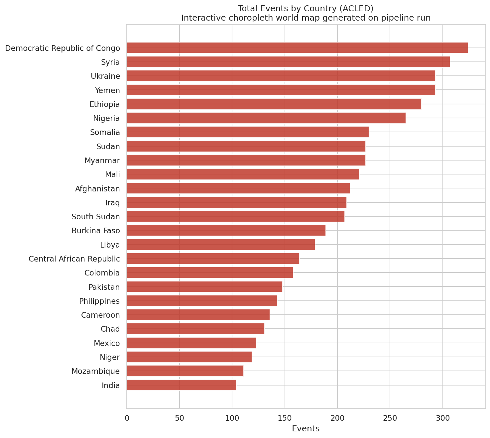
<br><sub><b>Events by Country</b> — choropleth world map. Interactive Plotly version on pipeline run.</sub>
</td>
<td width="50%">
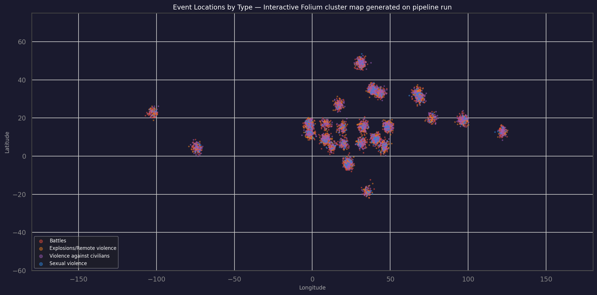
<br><sub><b>Event Locations</b> — each point is one event, coloured by type. Interactive Folium cluster map with actor + date tooltips on pipeline run.</sub>
</td>
</tr>
</table>

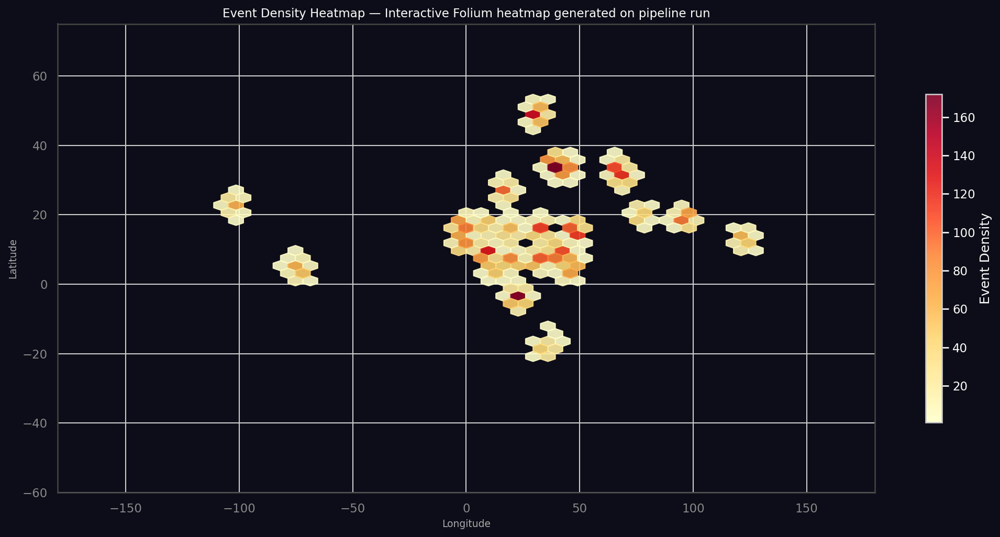
<sub><b>Event Density Heatmap</b> — hexbin density across all coordinates. Interactive Folium heatmap on pipeline run.</sub>

---

### Temporal

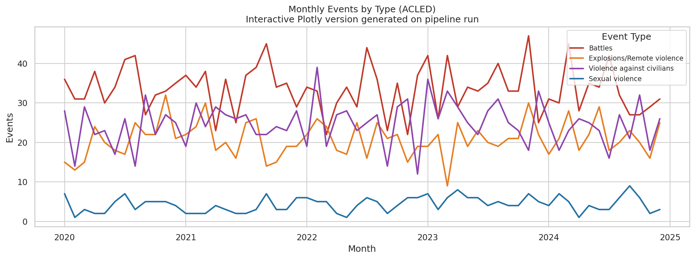
<sub><b>Monthly Events by Type</b> — full date range, broken out by event type. Interactive Plotly line chart on pipeline run.</sub>

<table>
<tr>
<td width="50%">
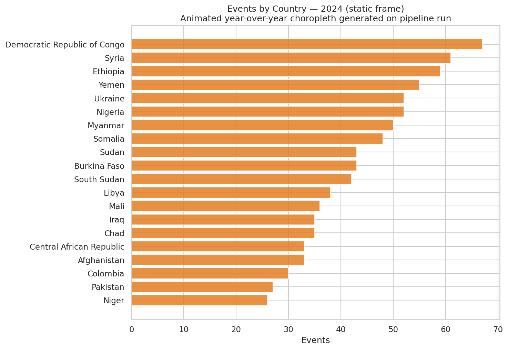
<br><sub><b>Hotspot Shift by Year</b> — most-recent-year frame shown. Full animated Plotly choropleth on pipeline run.</sub>
</td>
<td width="50%">
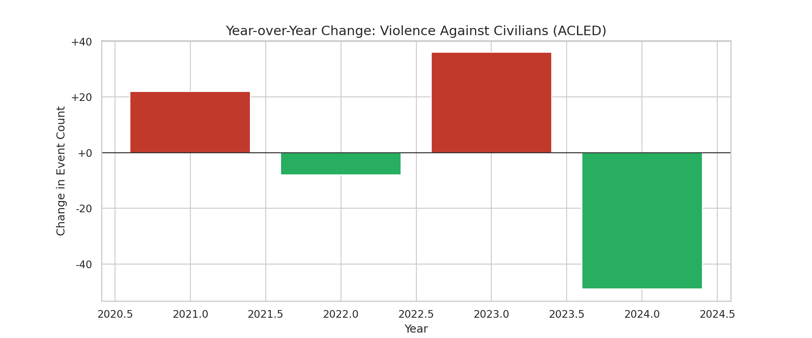
<br><sub><b>Year-over-Year Change</b> — violence against civilians specifically. Red = increase, green = decrease.</sub>
</td>
</tr>
</table>

---

### Actor Analysis

<table>
<tr>
<td width="50%">
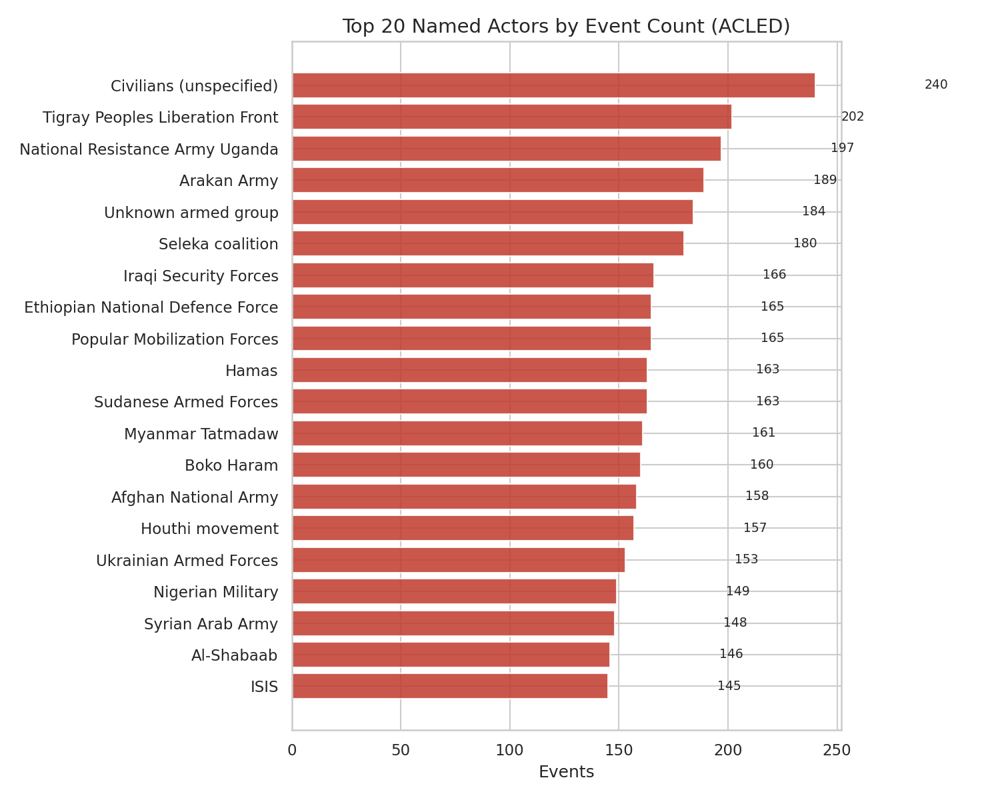
<br><sub><b>Top 20 Named Actors</b> — horizontal bar by total event count.</sub>
</td>
<td width="50%">
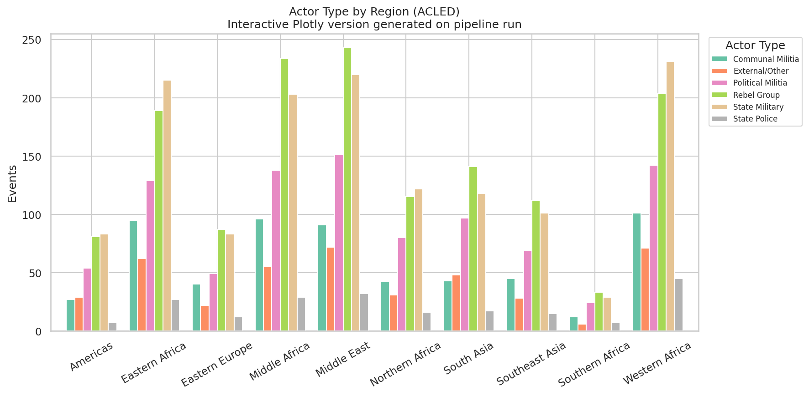
<br><sub><b>Actor Type by Region</b> — stacked bar breaking down state vs. non-state actors. Interactive Plotly version on pipeline run.</sub>
</td>
</tr>
</table>

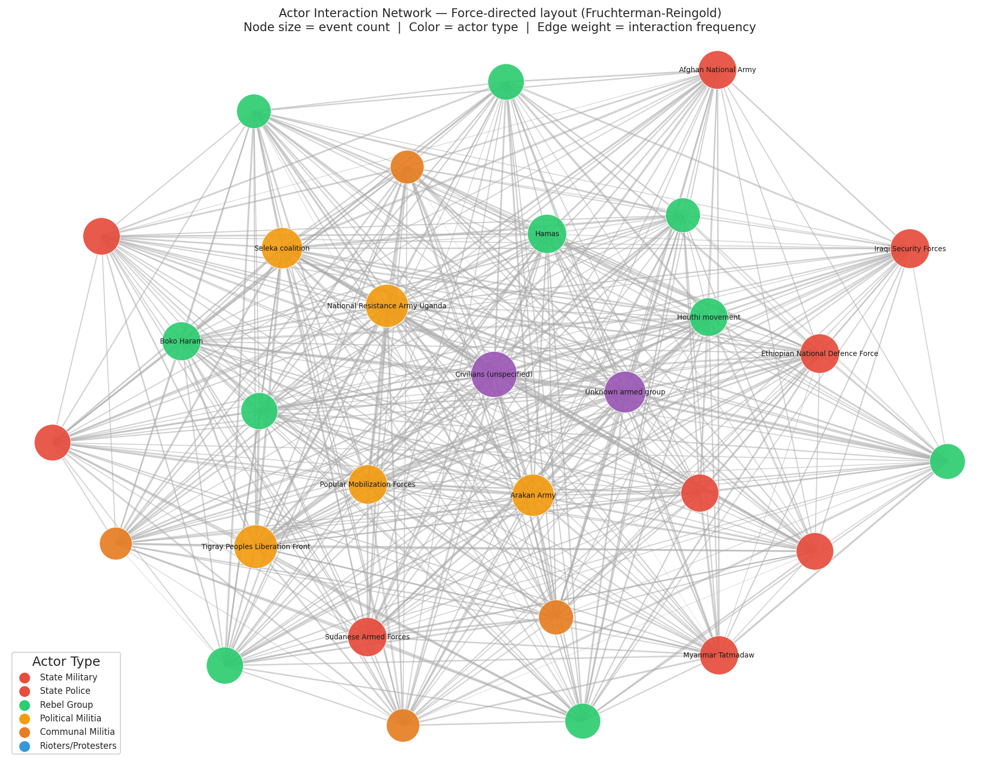
<sub><b>Actor Interaction Network</b> — force-directed layout (Fruchterman-Reingold). Node size = event count. Color = actor type (red = state, green = rebel, orange = militia). Edge weight = interaction frequency. Interactive Plotly version on pipeline run.</sub>

---

### Accountability Gap & Data Quality

<table>
<tr>
<td width="50%">
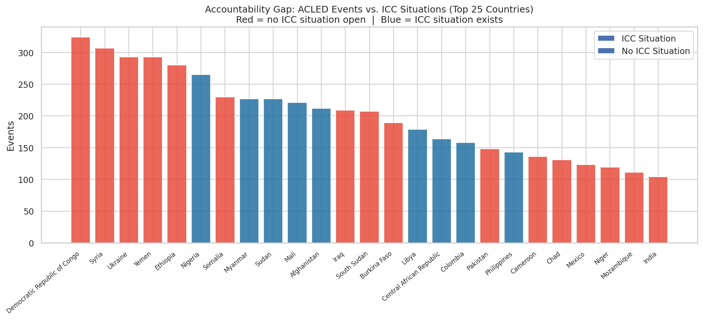
<br><sub><b>Accountability Gap</b> — top countries by UCDP event count, coloured by ICC situation status. Red = high events, no ICC situation open.</sub>
</td>
<td width="50%">
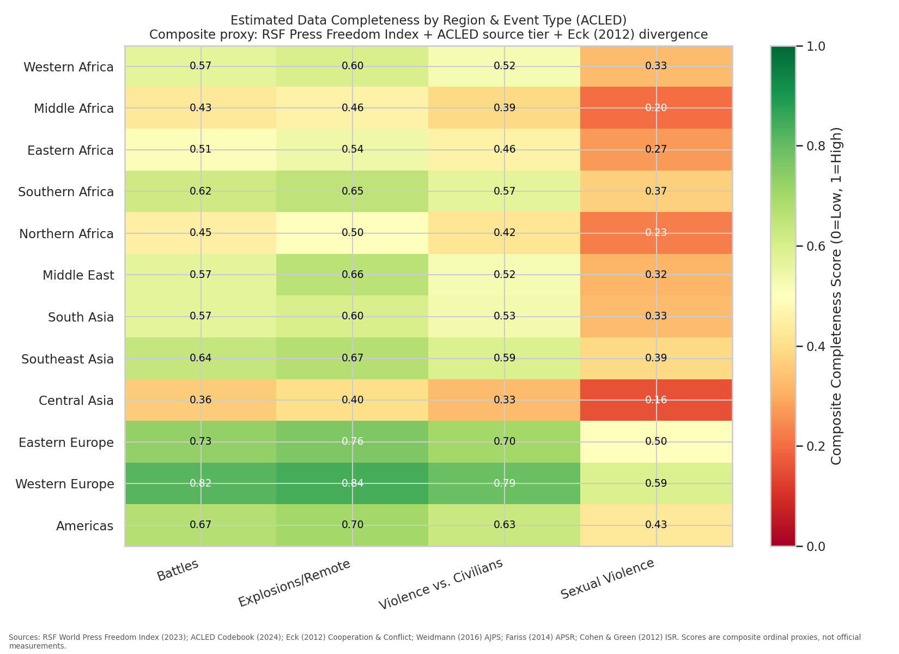
<br><sub><b>Data Completeness</b> — composite proxy by region and event type. Derived from RSF Press Freedom Index (2023), UCDP source tier, and Eck (2012) inter-source divergence.</sub>
</td>
</tr>
</table>

---

### Fatality & Escalation Analysis

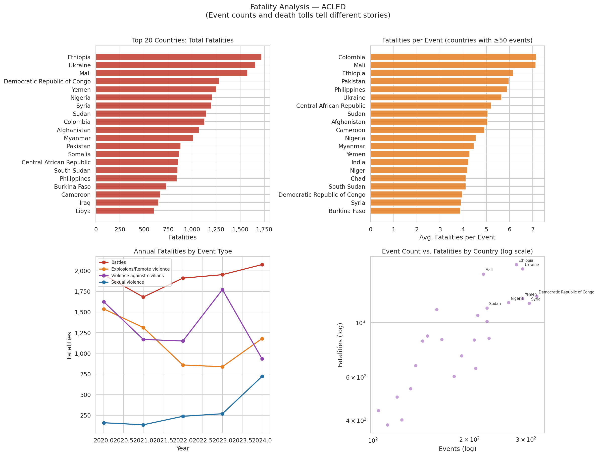
<sub><b>Fatality Analysis</b> — event counts and death tolls tell different stories. Top-left: countries by total deaths. Top-right: lethality ratio (deaths per event). Bottom-left: annual deaths by type. Bottom-right: event count vs. fatalities scatter (log scale).</sub>

<table>
<tr>
<td width="50%">
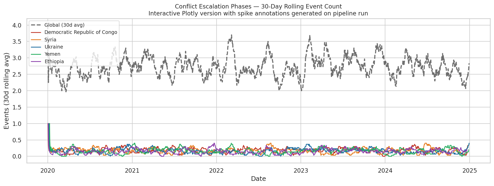
<br><sub><b>Escalation Phases</b> — 30-day rolling event count for top countries and globally. Interactive Plotly version with spike annotations on pipeline run.</sub>
</td>
<td width="50%">
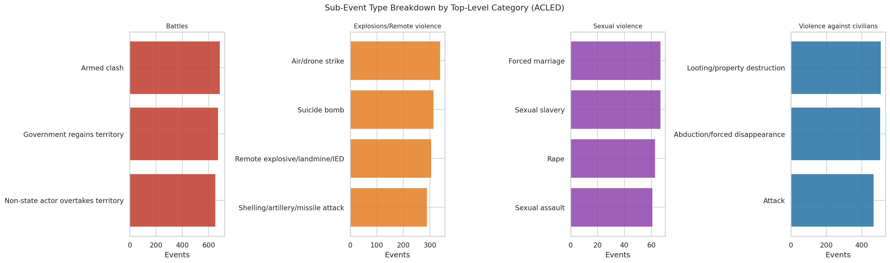
<br><sub><b>Escalation Phases</b> — 30-day rolling event count for top countries globally. Interactive Plotly version with spike annotations on pipeline run.</sub>
</td>
</tr>
</table>

---

### Source & Reporting Transparency

<table>
<tr>
<td width="50%">
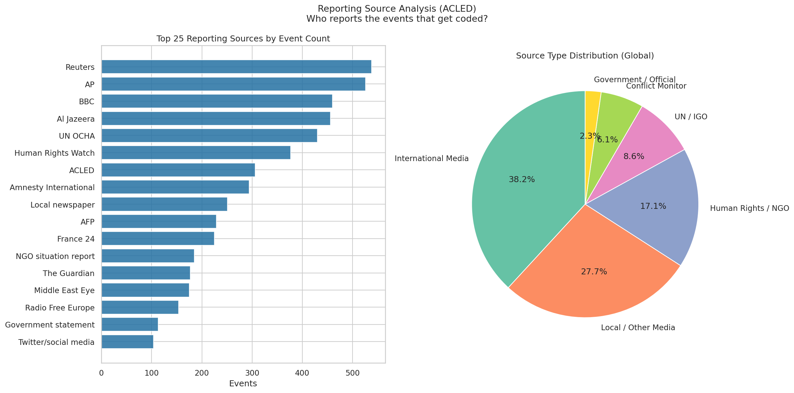
<br><sub><b>Reporting Sources</b> — top 25 sources by event count (left) and source type distribution globally (right).</sub>
</td>
<td width="50%">
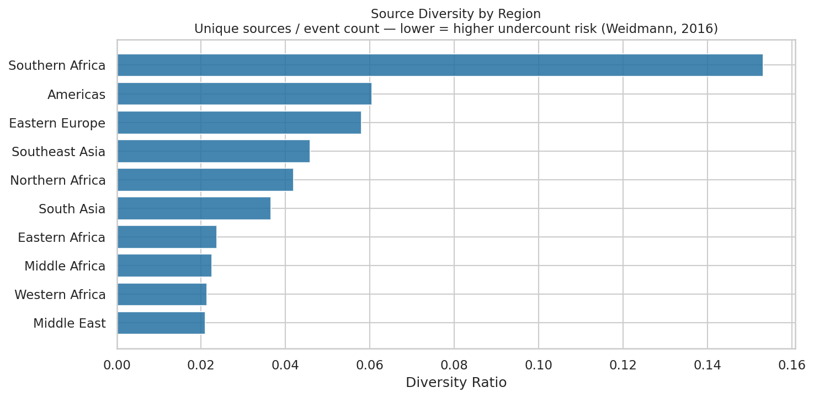
<br><sub><b>Source Diversity by Region</b> — unique sources per event count. Lower ratio = higher single-source dependency = higher undercount risk (Weidmann, 2016).</sub>
</td>
</tr>
</table>

---

<details>
<summary><b>Interactive output files (generated on pipeline run)</b></summary>

| File | Type |
|------|------|
| `outputs/choropleth_world.html` | Plotly interactive choropleth |
| `outputs/event_cluster_map.html` | Folium cluster map with tooltips |
| `outputs/heatmap_density.html` | Folium heatmap layer |
| `outputs/monthly_events_by_type.html` | Plotly line chart |
| `outputs/animated_timeseries.html` | Plotly animated choropleth |
| `outputs/actor_type_by_region.html` | Plotly stacked bar |
| `outputs/actor_network.html` | Plotly force-directed network |
| `outputs/accountability_gap.html` | Plotly grouped bar |
| `outputs/source_diversity.html` | Plotly bar |
| `outputs/escalation_phases.html` | Plotly rolling-avg line with spike annotations |
| `outputs/summary_aggregated.csv` | Aggregated findings export |

</details>

---

## The Prompt That Started This

The following is the original prompt used to kick off this project. It is preserved
here as documentation of the project's genesis and intent.

---

> I want to build a Python-based data pipeline and exploratory analysis project
> focused on war crimes and human rights violations. The goal is a clean GitHub
> repository that pulls, stores, and visualizes data from two sources:
>
> 1. ACLED (Armed Conflict Location & Event Data) — via their API at acleddata.com
> 2. HRDAG (Human Rights Data Analysis Group) — via their published datasets on hrdag.org
>
> Please do the following:
>
> **Setup**
> - Create a well-structured project with folders: /data/raw, /data/processed,
>   /notebooks, /src, /outputs
> - requirements.txt with all dependencies
> - .env.example for API keys (ACLED requires free registration for an API key)
> - README.md as described below
>
> **README**
> The README should include:
> - Project purpose and how to run it
> - A section titled "What Are War Crimes?" that covers:
>   - A clear definition accessible to a general audience
>   - Where the legal authority comes from (Geneva Conventions, Rome Statute,
>     customary international law, ICC jurisdiction)
>   - Known blind spots and limitations in accountability (e.g. permanent UN
>     Security Council members blocking referrals, non-ICC member states,
>     underreporting in active conflict zones, bias toward prosecuting
>     non-Western actors)
>   - Data limitations specific to ACLED and HRDAG (what they capture vs. miss)
> - A bibliography of sources used to write that section, formatted in Chicago
>   or APA style, including the Geneva Conventions, Rome Statute, and at least
>   3-4 academic or institutional sources
>
> **Data Ingestion**
> - Write a Python script (src/ingest.py) that pulls ACLED data filtered to
>   event types most associated with war crimes: battles, explosions/remote
>   violence, violence against civilians, and sexual violence
> - Pull at minimum the last 5 years of data globally
> - For HRDAG, pull or scrape their publicly available CSV/Excel datasets from
>   hrdag.org/publications — start with their Colombia or Guatemala datasets
>   as they are the most documented
> - Store raw data as CSV or Parquet in /data/raw
>
> **Analysis**
> - Write a Jupyter notebook (notebooks/01_eda.ipynb) that answers:
>   - Who are the actors (state vs non-state) committing the most documented violations?
>   - What event types are most common, and has that changed over time?
>   - When and where are violations most concentrated geographically?
>
> **Visualizations**
> Produce the following charts and maps — save all to /outputs:
>
> Geographic:
> - Choropleth world map of total violation events by country
> - Dot/cluster map of individual ACLED events with tooltip showing date, actor,
>   and event type (use folium or plotly)
> - Heatmap layer showing event density over geography
>
> Temporal:
> - Line chart of monthly event counts over time, broken out by event type
> - Animated time series map showing how conflict hotspots shift year over year
> - Bar chart of year-over-year change in violence against civilians specifically
>
> Actor Analysis:
> - Horizontal bar chart of top 20 named actors by event count
> - Stacked bar chart breaking actor type (state military, rebel group, militia,
>   etc.) by region
> - Network or chord diagram showing actor-vs-actor interaction (who fights whom)
>
> Accountability Gap:
> - Side-by-side comparison of countries with high ACLED event counts vs.
>   ICC cases opened — visualizing where violations occur but prosecution doesn't
> - A simple heatmap or table showing data completeness/confidence scores
>   by region to surface where underreporting is likely
>
> **Output**
> - Export a summary CSV to /outputs with aggregated findings
> - Keep code clean, commented, and portfolio-ready for GitHub
>
> Use pandas, requests, matplotlib/seaborn, plotly, and folium for mapping.
> Flag anywhere an API key or manual download step is needed.
>
> Also…save the prompt I'm using to kick this project off in the readme.
>
> And, tell me if I'm missing anything going into this. Ask me clarification
> questions if need be.

---

## Bibliography

All sources cited in the "What Are War Crimes?" section above.

**Primary Legal Instruments**

International Committee of the Red Cross. (1949). *Geneva Convention relative to the
protection of civilian persons in time of war (Fourth Geneva Convention)*, 12 August
1949, 75 UNTS 287. https://ihl-databases.icrc.org/en/ihl-treaties/gciv-1949

International Committee of the Red Cross. (1977). *Protocol additional to the Geneva
Conventions of 12 August 1949, and relating to the protection of victims of
non-international armed conflicts (Protocol II)*, 8 June 1977, 1125 UNTS 609.
https://ihl-databases.icrc.org/en/ihl-treaties/apii-1977

United Nations. (1998). *Rome Statute of the International Criminal Court*, 17 July
1998, A/CONF.183/9. https://www.icc-cpi.int/sites/default/files/RS-Eng.pdf

**Institutional Sources**

International Committee of the Red Cross. (2005). *Customary international
humanitarian law, Volume I: Rules*. Cambridge University Press.
https://www.icrc.org/en/doc/assets/files/other/customary-international-humanitarian-law-i-icrc-eng.pdf

International Criminal Court. (2024). *Understanding the ICC*. ICC Publications.
https://www.icc-cpi.int/understanding-the-icc

United Nations Security Council. (2014). *Draft resolution on referral of Syria to
the International Criminal Court* (S/2014/348, vetoed). UN Documentation Centre.
https://documents.un.org/doc/undoc/gen/n14/312/84/pdf/n1431284.pdf

**Academic and Policy Sources**

Bass, G. J. (2000). *Stay the hand of vengeance: The politics of war crimes tribunals*.
Princeton University Press.

Human Rights Watch. (2023). *ICC investigation updates and accountability
assessments*. https://www.hrw.org/topic/international-justice/international-criminal-court

Jallow, H. B., & Bensouda, F. (2004). International criminal law in practice:
Training materials for the judiciaries of Rwanda and other countries. UN ICTR.

Mamdani, M. (2010). Responsibility to protect or right to punish? *Journal of
Intervention and Statebuilding*, 4(1), 53–67.
https://doi.org/10.1080/17502970903541721

Stover, E., Balthazard, M., & Koenig, K. A. (2011). Confronting former combatants:
Transitional justice and the Extraordinary Chambers in Cambodia. *Conflict and Health*,
5(10). https://doi.org/10.1186/1752-1505-5-10

Vinjamuri, L., & Snyder, J. (2015). Law and politics in transitional justice.
*Annual Review of Political Science*, 18, 303–327.
https://doi.org/10.1146/annurev-polisci-042012-171955

**Data Methodology Sources**

ACLED. (2024). *ACLED codebook 2024*. Armed Conflict Location & Event Data Project.
https://acleddata.com/acleddatanerd/acled-codebook-2023/

Ball, P., Asher, J., Sulmont, D., & Manrique, D. (2003). *How many Peruvians have
died? An estimate of the total number of victims killed or disappeared in the armed
internal conflict between 1980 and 2000*. American Association for the Advancement
of Science. https://hrdag.org/peru-data/

Human Rights Data Analysis Group. (2024). *About HRDAG: Our methods*. HRDAG.
https://hrdag.org/about/

Raleigh, C., Linke, A., Hegre, H., & Karlsen, J. (2010). Introducing ACLED: An
armed conflict location and event dataset. *Journal of Peace Research*, 47(5),
651–660. https://doi.org/10.1177/0022343310378914

**Press Freedom & Conflict Data Reliability**
*(Cited in data completeness scores — see `src/visualize.py: chart_data_completeness`)*

Cohen, D. K., & Green, A. H. (2012). Dueling incentives: Sexual violence in
Liberia and the politics of human rights advocacy. *Journal of Peace Research*,
49(3), 445–458. https://doi.org/10.1177/0022343312436769
*(Demonstrates structural underreporting of sexual violence in conflict datasets
due to stigma and access constraints.)*

Davenport, C., & Ball, P. (2002). Views to a kill: Exploring the implications
of source selection in the case of Guatemalan state terror, 1977–1995. *Journal
of Conflict Resolution*, 46(3), 427–450.
https://doi.org/10.1177/0022002702046003005
*(Foundational study showing that source selection in conflict datasets
systematically biases coverage toward certain types of violence and certain
perpetrators.)*

Eck, K. (2012). In data we trust? A comparison of UCDP GED and ACLED conflict
events datasets. *Cooperation and Conflict*, 47(1), 80–94.
https://doi.org/10.1177/0010836711433559
*(Direct inter-source comparison revealing highest divergence — proxy for
undercount uncertainty — in Central Asia, Middle Africa, and parts of
Central America.)*

Fariss, C. J. (2014). Respect for human rights has improved over time: Modeling
the changing standard of accountability. *American Political Science Review*,
108(2), 297–408. https://doi.org/10.1017/S0003055414000070
*(Demonstrates that apparent improvements in human rights scores partly reflect
changing measurement standards and latent reporting bias, not only behavioral
change.)*

Reporters Without Borders. (2023). *World Press Freedom Index 2023*. RSF.
https://rsf.org/en/index
*(Annual ranking of 180 countries used as a proxy for structural reporting
capacity. Lower press freedom = fewer conflict events reach media-based
datasets like ACLED.)*

Weidmann, N. B. (2016). A closer look at reporting bias in conflict event data.
*American Journal of Political Science*, 60(4), 825–840.
https://doi.org/10.1111/ajps.12217
*(Key empirical study quantifying how media-based conflict datasets
systematically undercount events in low-press-freedom environments,
providing the primary justification for weighting completeness scores
by RSF index values.)*

Weidmann, N. B., & Salehyan, I. (2013). Violence and ethnic segregation: A
computational model applied to Baghdad. *International Studies Quarterly*,
57(1), 52–64. https://doi.org/10.1111/isqu.12033
*(Discusses satellite imagery and battlefield damage assessment as
supplementary sources for explosion/remote violence events in contested areas.)*
